# cham-lang Architecture Reference

> **Read this before planning or implementing any change.**
> Source: `embed-app/cham-lang` | Last updated: 2026-03-02

## Table of Contents

1. [System Overview](#1-system-overview)
2. [Data Models & Schema Contracts](#2-data-models--schema-contracts)
3. [ServiceFactory Lifecycle](#3-servicefactory-lifecycle)
4. [App-Level State Machine](#4-app-level-state-machine)
5. [Auth State Machine](#5-auth-state-machine)
6. [Practice Session State Machine](#6-practice-session-state-machine)
7. [Sync State Machine](#7-sync-state-machine)
8. [Component & Hook Dataflow](#8-component--hook-dataflow)
9. [Sequence: Add Vocabulary](#9-sequence-add-vocabulary)
10. [Sequence: Practice Session](#10-sequence-practice-session)
11. [Sequence: Sync Cycle](#11-sequence-sync-cycle)
12. [Routing & Navigation](#12-routing--navigation)
13. [Theme System](#13-theme-system)
14. [Embeddable Component Pattern](#14-embeddable-component-pattern)
15. [Spaced Repetition Algorithms](#15-spaced-repetition-algorithms)
16. [Component Hierarchy](#16-component-hierarchy)
17. [Internationalization (i18n)](#17-internationalization-i18n)
18. [Key Invariants & Anti-Patterns](#18-key-invariants--anti-patterns)

---

## 1. System Overview

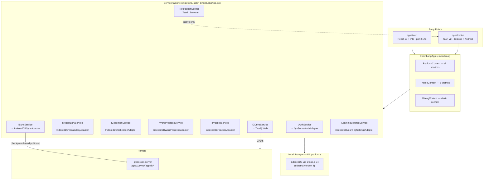
```mermaid
flowchart TD
    subgraph Entry["Entry Points"]
        WEB["apps/web\nReact 19 + Vite · port 5173"]
        TAURI["apps/native\nTauri v2 · desktop + Android"]
    end

    subgraph Root["ChamLangApp (embed root)"]
        CTX["PlatformContext — all services"]
        THEME["ThemeContext — 6 themes"]
        DIALOG["DialogContext — alert / confirm"]
    end

    subgraph Factory["ServiceFactory (singletons, set in ChamLangApp.tsx)"]
        AUTH["IAuthService\n→ QmServerAuthAdapter"]
        VOCAB["IVocabularyService\n→ IndexedDBVocabularyAdapter"]
        COLL["ICollectionService\n→ IndexedDBCollectionAdapter"]
        PROG["IWordProgressService\n→ IndexedDBWordProgressAdapter"]
        PRAC["IPracticeService\n→ IndexedDBPracticeAdapter"]
        SYNC["ISyncService\n→ IndexedDBSyncAdapter"]
        NOTIF["INotificationService\n→ Tauri | Browser"]
        GDRIVE["IGDriveService\n→ Tauri | Web"]
        SETTINGS["ILearningSettingsService\n→ IndexedDBLearningSettingsAdapter"]
    end

    subgraph DB["Local Storage — ALL platforms"]
        IDB["IndexedDB via Dexie.js v4\n(schema version 4)"]
    end

    subgraph Remote["Remote"]
        SERVER["glean-oak-server\n/api/v1/sync/{appId}/*"]
    end

    WEB --> Root
    TAURI --> Root
    Root --> Factory
    Factory --> DB
    SYNC -->|"checkpoint-based pull/push"| SERVER
    NOTIF -.->|"native only"| TAURI
    GDRIVE -.->|"OAuth"| Remote
```

**Platform split:**

| Layer | All platforms | Tauri-only |
|-------|--------------|------------|
| Data | IndexedDB (Dexie.js) | — |
| Notifications | — | `TauriNotificationAdapter` |
| GDrive OAuth | `WebGDriveAdapter` (GIS popup) | `TauriGDriveAdapter` (plugin) |
| Auth | `QmServerAuthAdapter` (HTTP + localStorage) | — |

---

## 2. Data Models & Schema Contracts

### Entity Relationships

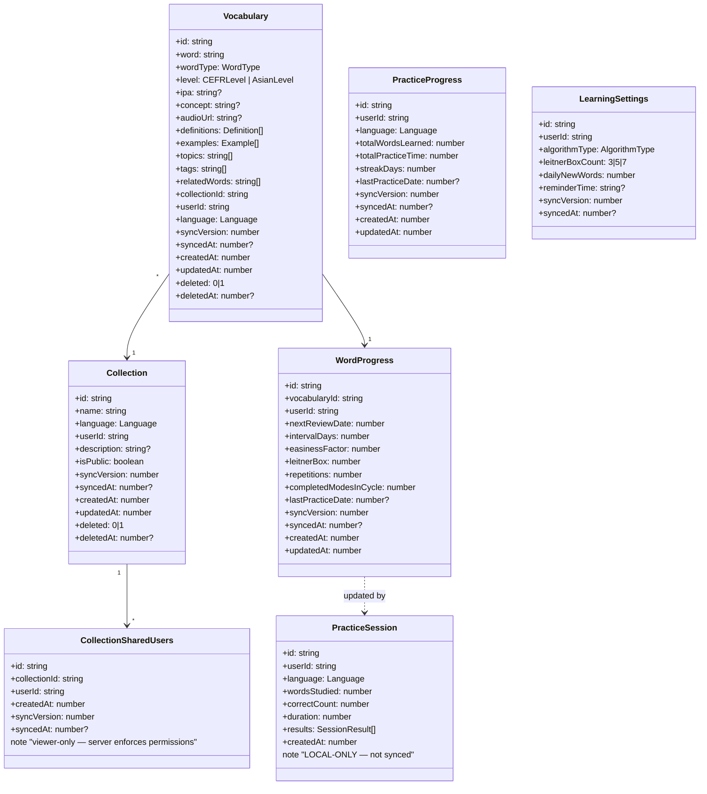
```mermaid
classDiagram
    class Vocabulary {
        +id: string
        +word: string
        +wordType: WordType
        +level: CEFRLevel | AsianLevel
        +ipa: string?
        +concept: string?
        +audioUrl: string?
        +definitions: Definition[]
        +examples: Example[]
        +topics: string[]
        +tags: string[]
        +relatedWords: string[]
        +collectionId: string
        +userId: string
        +language: Language
        +syncVersion: number
        +syncedAt: number?
        +createdAt: number
        +updatedAt: number
        +deleted: 0|1
        +deletedAt: number?
    }

    class Collection {
        +id: string
        +name: string
        +language: Language
        +userId: string
        +description: string?
        +isPublic: boolean
        +syncVersion: number
        +syncedAt: number?
        +createdAt: number
        +updatedAt: number
        +deleted: 0|1
        +deletedAt: number?
    }

    class WordProgress {
        +id: string
        +vocabularyId: string
        +userId: string
        +nextReviewDate: number
        +intervalDays: number
        +easinessFactor: number
        +leitnerBox: number
        +repetitions: number
        +completedModesInCycle: number
        +lastPracticeDate: number?
        +syncVersion: number
        +syncedAt: number?
        +createdAt: number
        +updatedAt: number
    }

    class PracticeProgress {
        +id: string
        +userId: string
        +language: Language
        +totalWordsLearned: number
        +totalPracticeTime: number
        +streakDays: number
        +lastPracticeDate: number?
        +syncVersion: number
        +syncedAt: number?
        +createdAt: number
        +updatedAt: number
    }

    class LearningSettings {
        +id: string
        +userId: string
        +algorithmType: AlgorithmType
        +leitnerBoxCount: 3|5|7
        +dailyNewWords: number
        +reminderTime: string?
        +syncVersion: number
        +syncedAt: number?
    }

    class CollectionSharedUsers {
        +id: string
        +collectionId: string
        +userId: string
        +createdAt: number
        +syncVersion: number
        +syncedAt: number?
        note "viewer-only — server enforces permissions"
    }

    class PracticeSession {
        +id: string
        +userId: string
        +language: Language
        +wordsStudied: number
        +correctCount: number
        +duration: number
        +results: SessionResult[]
        +createdAt: number
        note "LOCAL-ONLY — not synced"
    }

    Vocabulary "*" --> "1" Collection
    Collection "1" --> "*" CollectionSharedUsers
    Vocabulary "1" --> "1" WordProgress
    WordProgress ..> PracticeSession : updated by
```

### Enum Values

| Type | Values |
|------|--------|
| `WordType` | noun, verb, adjective, adverb, pronoun, preposition, conjunction, phrase, other |
| `CEFRLevel` | A1, A2, B1, B2, C1, C2 |
| `AsianLevel` | basic, intermediate, advanced |
| `Language` | en, vi, ja, ko, zh, fr, de, es |
| `AlgorithmType` | sm2, modified-sm2, simple-doubling |

### Sync Column Convention

All synced tables use **camelCase** field names:

```
syncVersion   — incremented on every local write
syncedAt      — null until confirmed by server
createdAt     — ms timestamp, set on create
updatedAt     — ms timestamp, updated on every write
deleted       — 0 | 1 (integer, not boolean)
deletedAt     — ms timestamp when soft-deleted
```

**Not synced:** `practiceSessions` (local-only by design), `_syncMeta`, `_pendingChanges`

---

## 3. ServiceFactory Lifecycle

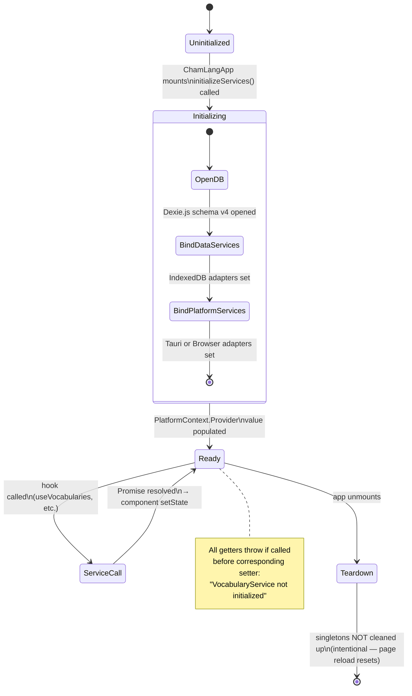
```mermaid
stateDiagram-v2
    [*] --> Uninitialized

    Uninitialized --> Initializing : ChamLangApp mounts\ninitializeServices() called

    state Initializing {
        [*] --> OpenDB
        OpenDB --> BindDataServices : Dexie.js schema v4 opened
        BindDataServices --> BindPlatformServices : IndexedDB adapters set
        BindPlatformServices --> [*] : Tauri or Browser adapters set
    }

    Initializing --> Ready : PlatformContext.Provider\nvalue populated

    Ready --> ServiceCall : hook called\n(useVocabularies, etc.)
    ServiceCall --> Ready : Promise resolved\n→ component setState

    Ready --> Teardown : app unmounts
    Teardown --> [*] : singletons NOT cleaned up\n(intentional — page reload resets)

    note right of Ready
        All getters throw if called
        before corresponding setter:
        "VocabularyService not initialized"
    end note
```

---

## 4. App-Level State Machine

```mermaid
stateDiagram-v2
    direction LR

    [*] --> Boot

    state Boot {
        [*] --> CheckEmbeddedProp
        CheckEmbeddedProp --> EmbeddedMode : embedded=true\n& authTokens provided
        CheckEmbeddedProp --> StandaloneMode : no embedded prop
    }

    state EmbeddedMode {
        [*] --> InjectTokens
        InjectTokens --> RouteReady : authTokens stored\nin localStorage
        note "useRouter=false — uses\nparent BrowserRouter"
    }

    state StandaloneMode {
        [*] --> CheckStoredJWT
        CheckStoredJWT --> RouteReady : valid accessToken in localStorage
        CheckStoredJWT --> AuthPage : no token → /login
    }

    EmbeddedMode --> AppReady
    StandaloneMode --> AppReady

    state AppReady {
        [*] --> Idle
        Idle --> Navigating : user action
        Navigating --> Idle : page rendered
    }

    AppReady --> SyncCycle : ISyncService auto-trigger\n(interval or app focus)
    SyncCycle --> AppReady : complete — non-blocking
```

---

## 5. Auth State Machine

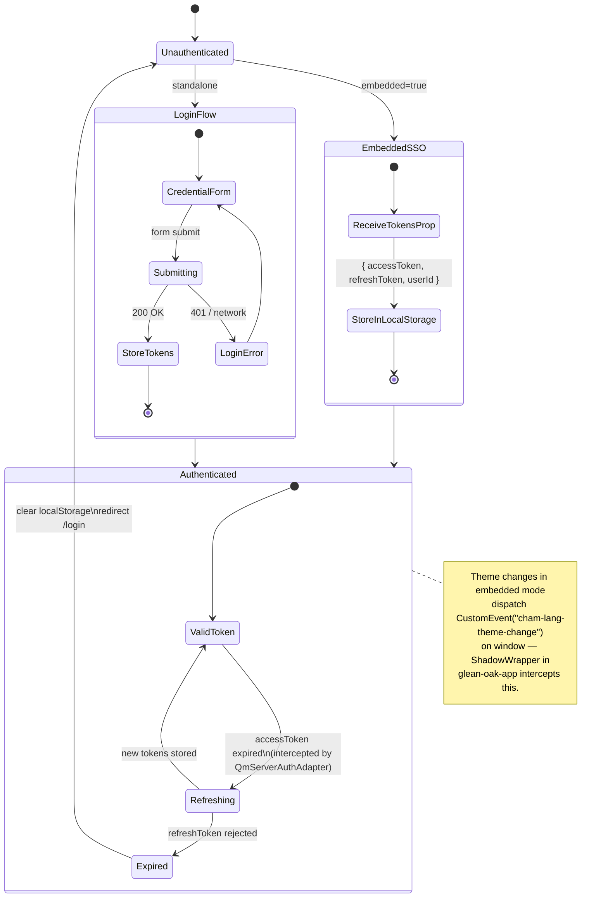
```mermaid
stateDiagram-v2
    [*] --> Unauthenticated

    state EmbeddedSSO {
        [*] --> ReceiveTokensProp
        ReceiveTokensProp --> StoreInLocalStorage : { accessToken, refreshToken, userId }
        StoreInLocalStorage --> [*]
    }

    Unauthenticated --> EmbeddedSSO : embedded=true
    EmbeddedSSO --> Authenticated

    state LoginFlow {
        [*] --> CredentialForm
        CredentialForm --> Submitting : form submit
        Submitting --> StoreTokens : 200 OK
        Submitting --> LoginError : 401 / network
        LoginError --> CredentialForm
        StoreTokens --> [*]
    }

    Unauthenticated --> LoginFlow : standalone
    LoginFlow --> Authenticated

    state Authenticated {
        [*] --> ValidToken
        ValidToken --> Refreshing : accessToken expired\n(intercepted by QmServerAuthAdapter)
        Refreshing --> ValidToken : new tokens stored
        Refreshing --> Expired : refreshToken rejected
    }

    Expired --> Unauthenticated : clear localStorage\nredirect /login

    note right of Authenticated
        Theme changes in embedded mode
        dispatch CustomEvent("cham-lang-theme-change")
        on window — ShadowWrapper in
        glean-oak-app intercepts this.
    end note
```

---

## 6. Practice Session State Machine

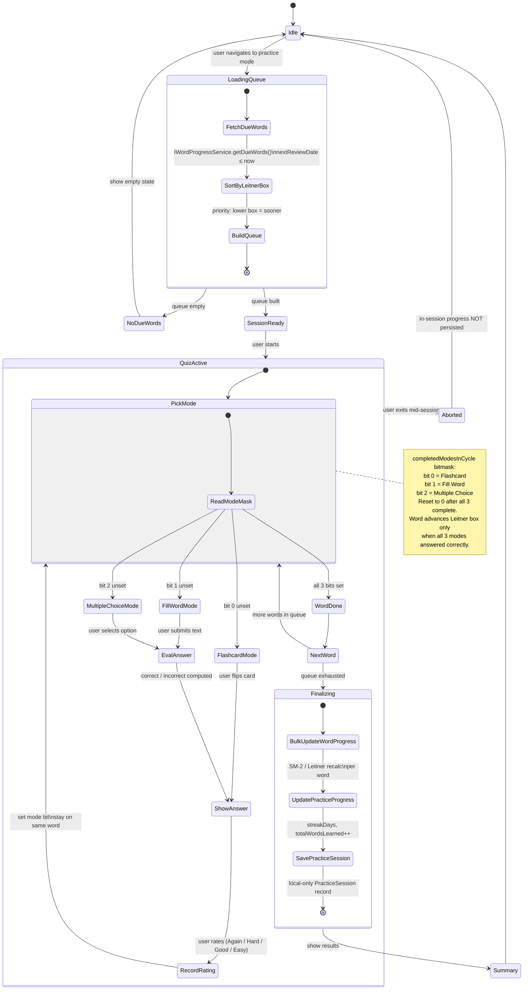
```mermaid
stateDiagram-v2
    [*] --> Idle

    Idle --> LoadingQueue : user navigates to practice mode

    state LoadingQueue {
        [*] --> FetchDueWords
        FetchDueWords --> SortByLeitnerBox : IWordProgressService.getDueWords()\nnextReviewDate ≤ now
        SortByLeitnerBox --> BuildQueue : priority: lower box = sooner
        BuildQueue --> [*]
    }

    LoadingQueue --> NoDueWords : queue empty
    LoadingQueue --> SessionReady : queue built

    NoDueWords --> Idle : show empty state

    SessionReady --> QuizActive : user starts

    state QuizActive {
        [*] --> PickMode

        state PickMode {
            [*] --> ReadModeMask
            ReadModeMask --> FlashcardMode : bit 0 unset
            ReadModeMask --> FillWordMode : bit 1 unset
            ReadModeMask --> MultipleChoiceMode : bit 2 unset
            ReadModeMask --> WordDone : all 3 bits set
        }

        FlashcardMode --> ShowAnswer : user flips card
        FillWordMode --> EvalAnswer : user submits text
        MultipleChoiceMode --> EvalAnswer : user selects option

        EvalAnswer --> ShowAnswer : correct / incorrect computed
        ShowAnswer --> RecordRating : user rates (Again / Hard / Good / Easy)

        RecordRating --> PickMode : set mode bit\nstay on same word

        WordDone --> NextWord
        NextWord --> PickMode : more words in queue
        NextWord --> Finalizing : queue exhausted
    }

    QuizActive --> Aborted : user exits mid-session

    state Finalizing {
        [*] --> BulkUpdateWordProgress
        BulkUpdateWordProgress --> UpdatePracticeProgress : SM-2 / Leitner recalc\nper word
        UpdatePracticeProgress --> SavePracticeSession : streakDays, totalWordsLearned++
        SavePracticeSession --> [*] : local-only PracticeSession record
    }

    Finalizing --> Summary : show results
    Summary --> Idle

    Aborted --> Idle : in-session progress NOT persisted

    note right of PickMode
        completedModesInCycle bitmask:
          bit 0 = Flashcard
          bit 1 = Fill Word
          bit 2 = Multiple Choice
        Reset to 0 after all 3 complete.
        Word advances Leitner box only
        when all 3 modes answered correctly.
    end note
```

### SM-2 / Algorithm Variants

| Setting | `intervalDays` recalc | `easinessFactor` |
|---------|-----------------------|-----------------|
| `sm2` | SM-2 formula: `I(n) = I(n-1) × EF` | Dynamic, adjusted per rating |
| `modified-sm2` | Fixed intervals per Leitner box | Fixed |
| `simple-doubling` | Doubles on correct, resets on fail | Not used |

---

## 7. Sync State Machine

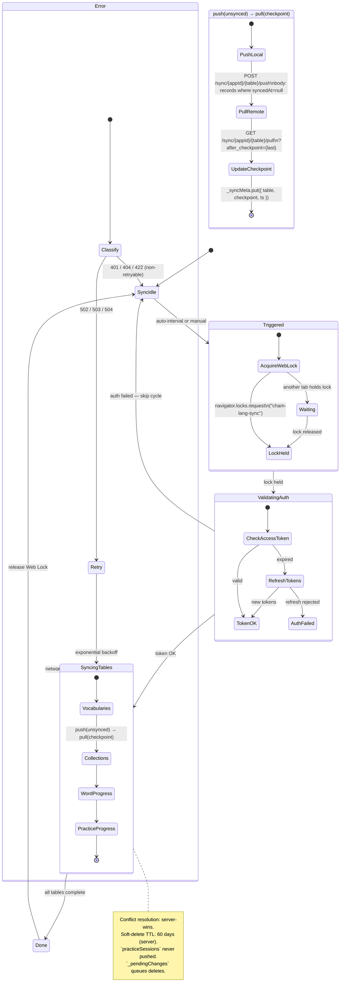
```mermaid
stateDiagram-v2
    [*] --> SyncIdle

    SyncIdle --> Triggered : auto-interval or manual

    state Triggered {
        [*] --> AcquireWebLock
        AcquireWebLock --> LockHeld : navigator.locks.request\n("cham-lang-sync")
        AcquireWebLock --> Waiting : another tab holds lock
        Waiting --> LockHeld : lock released
    }

    Triggered --> ValidatingAuth : lock held

    state ValidatingAuth {
        [*] --> CheckAccessToken
        CheckAccessToken --> TokenOK : valid
        CheckAccessToken --> RefreshTokens : expired
        RefreshTokens --> TokenOK : new tokens
        RefreshTokens --> AuthFailed : refresh rejected
    }

    ValidatingAuth --> SyncingTables : token OK
    ValidatingAuth --> SyncIdle : auth failed — skip cycle

    state SyncingTables {
        [*] --> Vocabularies
        Vocabularies --> Collections : push(unsynced) → pull(checkpoint)
        Collections --> WordProgress
        WordProgress --> PracticeProgress
        PracticeProgress --> [*]
    }

    state "push(unsynced) → pull(checkpoint)" as PushPull {
        [*] --> PushLocal
        PushLocal --> PullRemote : POST /sync/{appId}/{table}/push\nbody: records where syncedAt=null
        PullRemote --> UpdateCheckpoint : GET /sync/{appId}/{table}/pull\n?after_checkpoint={last}
        UpdateCheckpoint --> [*] : _syncMeta.put({ table, checkpoint, ts })
    }

    SyncingTables --> Done : all tables complete
    SyncingTables --> Error : network / 5xx

    state Error {
        [*] --> Classify
        Classify --> Retry : 502 / 503 / 504
        Classify --> SyncIdle : 401 / 404 / 422 (non-retryable)
        Retry --> SyncingTables : exponential backoff
    }

    Done --> SyncIdle : release Web Lock

    note right of SyncingTables
        Conflict resolution: server-wins.
        Soft-delete TTL: 60 days (server).
        `practiceSessions` never pushed.
        `_pendingChanges` queues deletes.
    end note
```

---

## 8. Component & Hook Dataflow

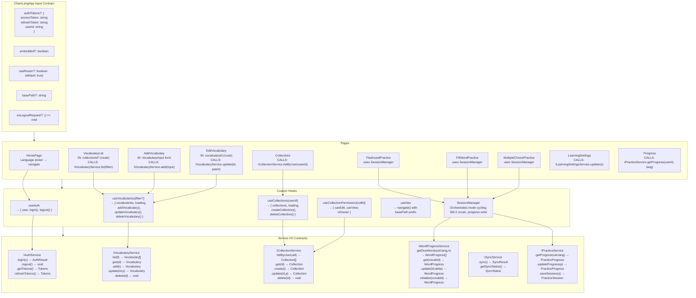
```mermaid
flowchart TD
    subgraph Props["ChamLangApp Input Contract"]
        P1["authTokens?: {\n  accessToken: string\n  refreshToken: string\n  userId: string\n}"]
        P2["embedded?: boolean"]
        P3["useRouter?: boolean  (default: true)"]
        P4["basePath?: string"]
        P5["onLogoutRequest?: () => void"]
    end

    subgraph Pages
        HOME["HomePage\nLanguage picker → navigate"]
        VOCAB_LIST["VocabularyList\nIN: collectionId? (route)\nCALLS: IVocabularyService.list(filter)"]
        VOCAB_ADD["AddVocabulary\nIN: VocabularyInput form\nCALLS: IVocabularyService.add(input)"]
        VOCAB_EDIT["EditVocabulary\nIN: vocabularyId (route)\nCALLS: IVocabularyService.update(id, patch)"]
        COLLECTIONS["Collections\nCALLS: ICollectionService.listByUser(userId)"]
        FLASHCARD["FlashcardPractice\nuses SessionManager"]
        FILL_WORD["FillWordPractice\nuses SessionManager"]
        MC["MultipleChoicePractice\nuses SessionManager"]
        SETTINGS["LearningSettings\nCALLS: ILearningSettingsService.update(s)"]
        PROGRESS["Progress\nCALLS: IPracticeService.getProgress(userId, lang)"]
    end

    subgraph Hooks["Custom Hooks"]
        H_AUTH["useAuth\n→ { user, login(), logout() }"]
        H_VOCAB["useVocabularies(filter?)\n→ { vocabularies, loading,\n   addVocabulary(), updateVocabulary(),\n   deleteVocabulary() }"]
        H_COLL["useCollections(userId)\n→ { collections, loading,\n   createCollection(), deleteCollection() }"]
        H_PERM["useCollectionPermission(collId)\n→ { canEdit, canView, isOwner }"]
        H_NAV["useNav\n→ navigate() with basePath prefix"]
        SESSION["SessionManager\nOrchestrates mode cycling,\nSM-2 recalc, progress write"]
    end

    subgraph Services["Service I/O Contracts"]
        SV["IVocabularyService\n.list(f) → Vocabulary[]\n.get(id) → Vocabulary\n.add(i) → Vocabulary\n.update(id,p) → Vocabulary\n.delete(id) → void"]
        SC["ICollectionService\n.listByUser(uid) → Collection[]\n.get(id) → Collection\n.create(i) → Collection\n.update(id,p) → Collection\n.delete(id) → void"]
        SP["IWordProgressService\n.getDueWords(uid,lang,n) → WordProgress[]\n.get(vocabId) → WordProgress\n.update(id,delta) → WordProgress\n.initialize(vocabId) → WordProgress"]
        SPRAC["IPracticeService\n.getProgress(uid,lang) → PracticeProgress\n.updateProgress(p) → PracticeProgress\n.saveSession(s) → PracticeSession"]
        SSYNC["ISyncService\n.sync() → SyncResult\n.getSyncStatus() → SyncStatus"]
        SAUTH["IAuthService\n.login(c) → AuthResult\n.logout() → void\n.getTokens() → Tokens\n.refreshTokens() → Tokens"]
    end

    Props --> Pages
    Pages --> Hooks
    Hooks --> Services

    VOCAB_LIST & VOCAB_ADD & VOCAB_EDIT --> H_VOCAB --> SV
    COLLECTIONS --> H_COLL --> SC
    H_PERM --> SC
    FLASHCARD & FILL_WORD & MC --> SESSION --> SP & SPRAC
    HOME --> H_AUTH --> SAUTH
```

---

## 9. Sequence: Add Vocabulary

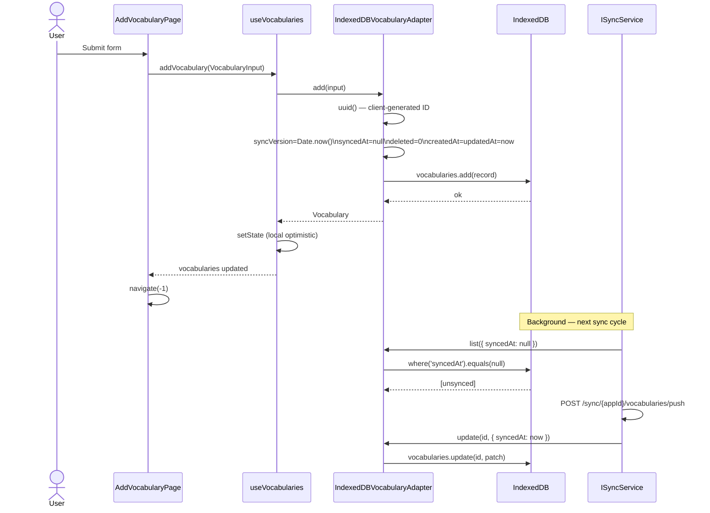
```mermaid
sequenceDiagram
    actor U as User
    participant F as AddVocabularyPage
    participant H as useVocabularies
    participant ADP as IndexedDBVocabularyAdapter
    participant DB as IndexedDB
    participant SYNC as ISyncService

    U->>F: Submit form
    F->>H: addVocabulary(VocabularyInput)
    H->>ADP: add(input)

    ADP->>ADP: uuid() — client-generated ID
    ADP->>ADP: syncVersion=Date.now()\nsyncedAt=null\ndeleted=0\ncreatedAt=updatedAt=now

    ADP->>DB: vocabularies.add(record)
    DB-->>ADP: ok
    ADP-->>H: Vocabulary
    H->>H: setState (local optimistic)
    H-->>F: vocabularies updated
    F->>F: navigate(-1)

    Note over SYNC,DB: Background — next sync cycle
    SYNC->>ADP: list({ syncedAt: null })
    ADP->>DB: where('syncedAt').equals(null)
    DB-->>ADP: [unsynced]
    SYNC->>SYNC: POST /sync/{appId}/vocabularies/push
    SYNC->>ADP: update(id, { syncedAt: now })
    ADP->>DB: vocabularies.update(id, patch)
```

---

## 10. Sequence: Practice Session

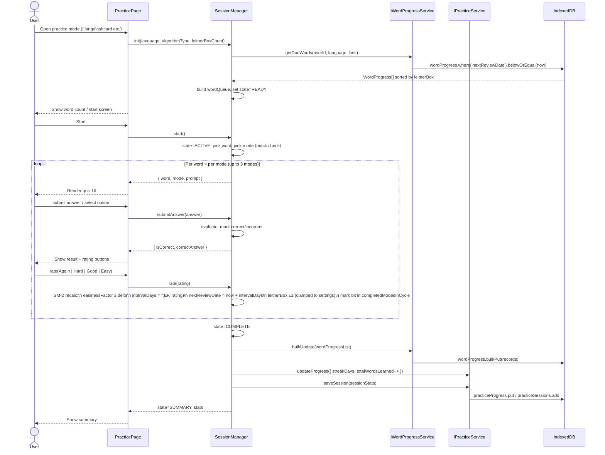
```mermaid
sequenceDiagram
    actor U as User
    participant P as PracticePage
    participant SM as SessionManager
    participant WPS as IWordProgressService
    participant PRAC as IPracticeService
    participant DB as IndexedDB

    U->>P: Open practice mode (/:lang/flashcard etc.)
    P->>SM: init(language, algorithmType, leitnerBoxCount)
    SM->>WPS: getDueWords(userId, language, limit)
    WPS->>DB: wordProgress.where('nextReviewDate').belowOrEqual(now)
    DB-->>SM: WordProgress[] sorted by leitnerBox

    SM->>SM: build wordQueue, set state=READY
    P-->>U: Show word count / start screen

    U->>P: Start
    P->>SM: start()
    SM->>SM: state=ACTIVE, pick word, pick mode (mask check)

    loop Per word × per mode (up to 3 modes)
        SM-->>P: { word, mode, prompt }
        P-->>U: Render quiz UI

        U->>P: submit answer / select option
        P->>SM: submitAnswer(answer)
        SM->>SM: evaluate, mark correct/incorrect
        SM-->>P: { isCorrect, correctAnswer }
        P-->>U: Show result + rating buttons

        U->>P: rate(Again | Hard | Good | Easy)
        P->>SM: rate(rating)
        SM->>SM: SM-2 recalc:\n  easinessFactor ± delta\n  intervalDays = f(EF, rating)\n  nextReviewDate = now + intervalDays\n  leitnerBox ±1 (clamped to settings)\n  mark bit in completedModesInCycle
    end

    SM->>SM: state=COMPLETE
    SM->>WPS: bulkUpdate(wordProgressList)
    WPS->>DB: wordProgress.bulkPut(records)
    SM->>PRAC: updateProgress({ streakDays, totalWordsLearned++ })
    SM->>PRAC: saveSession(sessionStats)
    PRAC->>DB: practiceProgress.put / practiceSessions.add

    SM-->>P: state=SUMMARY, stats
    P-->>U: Show summary
```

---

## 11. Sequence: Sync Cycle

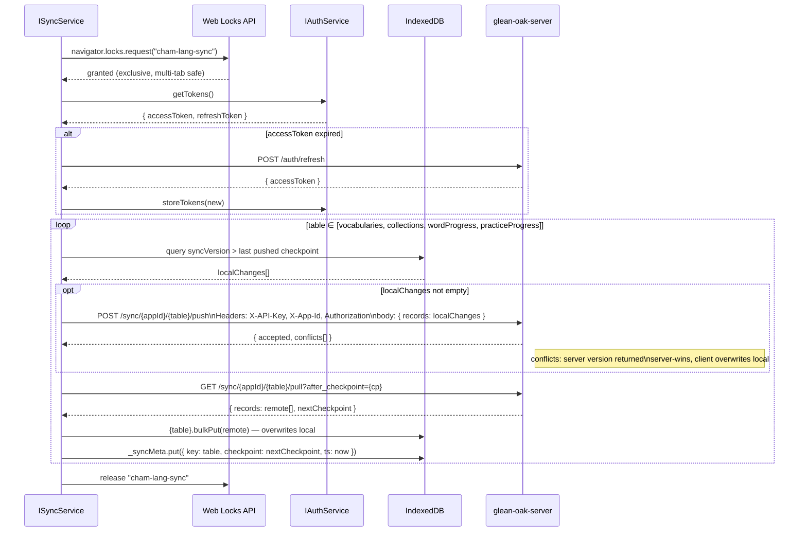
```mermaid
sequenceDiagram
    participant SYNC as ISyncService
    participant LOCK as Web Locks API
    participant AUTH as IAuthService
    participant DB as IndexedDB
    participant SERVER as glean-oak-server

    SYNC->>LOCK: navigator.locks.request("cham-lang-sync")
    LOCK-->>SYNC: granted (exclusive, multi-tab safe)

    SYNC->>AUTH: getTokens()
    AUTH-->>SYNC: { accessToken, refreshToken }

    alt accessToken expired
        SYNC->>SERVER: POST /auth/refresh
        SERVER-->>SYNC: { accessToken }
        SYNC->>AUTH: storeTokens(new)
    end

    loop table ∈ [vocabularies, collections, wordProgress, practiceProgress]
        SYNC->>DB: query syncVersion > last pushed checkpoint
        DB-->>SYNC: localChanges[]

        opt localChanges not empty
            SYNC->>SERVER: POST /sync/{appId}/{table}/push\nHeaders: X-API-Key, X-App-Id, Authorization\nbody: { records: localChanges }
            SERVER-->>SYNC: { accepted, conflicts[] }
            Note right of SERVER: conflicts: server version returned\nserver-wins, client overwrites local
        end

        SYNC->>SERVER: GET /sync/{appId}/{table}/pull?after_checkpoint={cp}
        SERVER-->>SYNC: { records: remote[], nextCheckpoint }
        SYNC->>DB: {table}.bulkPut(remote) — overwrites local
        SYNC->>DB: _syncMeta.put({ key: table, checkpoint: nextCheckpoint, ts: now })
    end

    SYNC->>LOCK: release "cham-lang-sync"
```

---

## 12. Routing & Navigation

### Route Map

All routes defined in `AppShell.tsx`, lazy-loaded via `React.lazy` for code splitting.

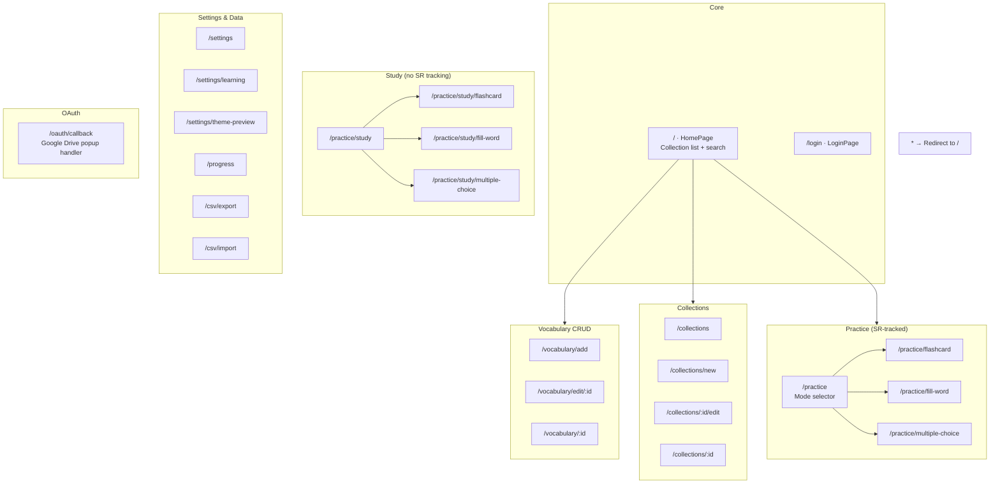
```mermaid
flowchart TD
    subgraph Core["Core"]
        HOME["/  ·  HomePage\nCollection list + search"]
        LOGIN["/login  ·  LoginPage"]
    end

    subgraph Vocabulary["Vocabulary CRUD"]
        V_ADD["/vocabulary/add"]
        V_EDIT["/vocabulary/edit/:id"]
        V_DETAIL["/vocabulary/:id"]
    end

    subgraph Collections["Collections"]
        C_LIST["/collections"]
        C_NEW["/collections/new"]
        C_EDIT["/collections/:id/edit"]
        C_DETAIL["/collections/:id"]
    end

    subgraph Practice["Practice (SR-tracked)"]
        P_MODE["/practice\nMode selector"]
        P_FLASH["/practice/flashcard"]
        P_FILL["/practice/fill-word"]
        P_MC["/practice/multiple-choice"]
    end

    subgraph Study["Study (no SR tracking)"]
        S_MODE["/practice/study"]
        S_FLASH["/practice/study/flashcard"]
        S_FILL["/practice/study/fill-word"]
        S_MC["/practice/study/multiple-choice"]
    end

    subgraph Settings["Settings & Data"]
        SETTINGS["/settings"]
        LEARNING["/settings/learning"]
        THEME_PREVIEW["/settings/theme-preview"]
        PROGRESS["/progress"]
        CSV_EXPORT["/csv/export"]
        CSV_IMPORT["/csv/import"]
    end

    subgraph OAuth["OAuth"]
        CALLBACK["/oauth/callback\nGoogle Drive popup handler"]
    end

    WILDCARD["*  →  Redirect to /"]

    HOME --> Vocabulary
    HOME --> Collections
    HOME --> Practice
    P_MODE --> P_FLASH & P_FILL & P_MC
    S_MODE --> S_FLASH & S_FILL & S_MC
```

### Navigation in Embedded Mode

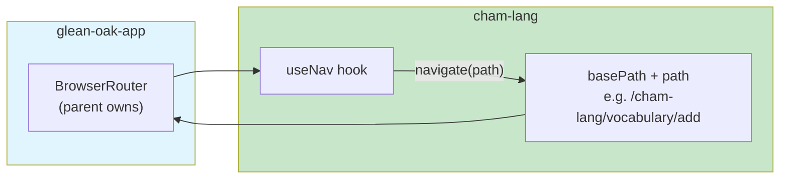
```mermaid
flowchart LR
    subgraph glean-oak["glean-oak-app"]
        ROUTER["BrowserRouter\n(parent owns)"]
    end

    subgraph cham-lang
        NAV["useNav hook"]
        NAV -->|"navigate(path)"| RESOLVED["basePath + path\ne.g. /cham-lang/vocabulary/add"]
    end

    ROUTER --> NAV
    RESOLVED --> ROUTER

    style glean-oak fill:#e1f5fe
    style cham-lang fill:#c8e6c9
```

`useNav` prepends `basePath` (from `BasePathContext`) to all `navigate()` calls. In standalone mode, `basePath` is empty.

---

## 13. Theme System

### Theme Resolution Flow

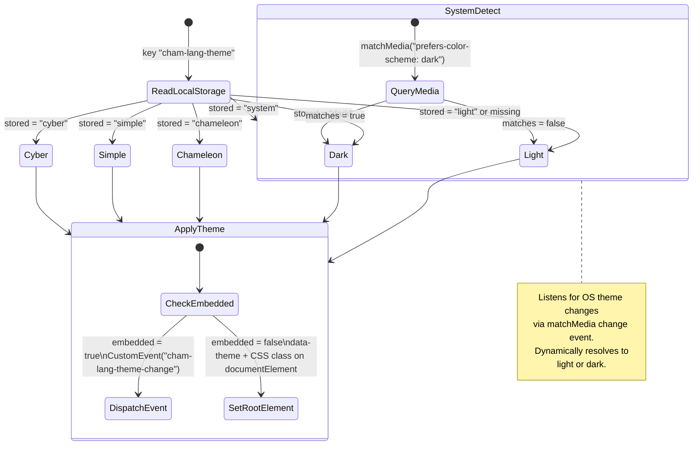
```mermaid
stateDiagram-v2
    [*] --> ReadLocalStorage : key "cham-lang-theme"

    ReadLocalStorage --> Light : stored = "light" or missing
    ReadLocalStorage --> Dark : stored = "dark"
    ReadLocalStorage --> Chameleon : stored = "chameleon"
    ReadLocalStorage --> Simple : stored = "simple"
    ReadLocalStorage --> Cyber : stored = "cyber"
    ReadLocalStorage --> SystemDetect : stored = "system"

    state SystemDetect {
        [*] --> QueryMedia : matchMedia("prefers-color-scheme: dark")
        QueryMedia --> Dark : matches = true
        QueryMedia --> Light : matches = false
    }

    state ApplyTheme {
        [*] --> CheckEmbedded
        CheckEmbedded --> DispatchEvent : embedded = true\nCustomEvent("cham-lang-theme-change")
        CheckEmbedded --> SetRootElement : embedded = false\ndata-theme + CSS class on documentElement
    }

    Light --> ApplyTheme
    Dark --> ApplyTheme
    Chameleon --> ApplyTheme
    Simple --> ApplyTheme
    Cyber --> ApplyTheme

    note right of SystemDetect
        Listens for OS theme changes
        via matchMedia change event.
        Dynamically resolves to
        light or dark.
    end note
```

### Theme Catalog

| Theme | CSS Class | Design Language | Fonts |
|-------|-----------|----------------|-------|
| Light | _(default, no class)_ | Pastel claymorphism | Fredoka + Nunito |
| Dark | `.dark` | Deep indigo | Fredoka + Nunito |
| Chameleon | `.chameleon` | Nature green glassmorphism | Fredoka + Nunito |
| Simple | `.simple` | Strict black & white | Fredoka + Nunito |
| Cyber | `.cyber` | Terminal aesthetic | JetBrains Mono |
| System | _(resolves to light/dark)_ | Follows OS preference | _(inherits)_ |

### CSS Architecture

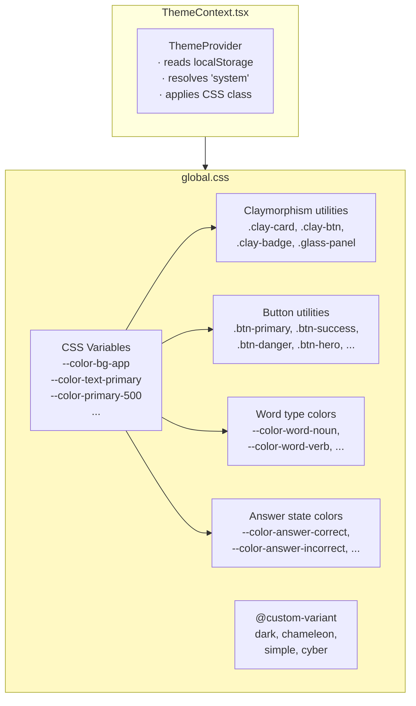
```mermaid
flowchart TD
    subgraph global_css["global.css"]
        VARS["CSS Variables\n--color-bg-app\n--color-text-primary\n--color-primary-500\n..."]
        VARIANTS["@custom-variant\ndark, chameleon,\nsimple, cyber"]
        CLAY["Claymorphism utilities\n.clay-card, .clay-btn,\n.clay-badge, .glass-panel"]
        BTN["Button utilities\n.btn-primary, .btn-success,\n.btn-danger, .btn-hero, ..."]
        WORD_COLORS["Word type colors\n--color-word-noun,\n--color-word-verb, ..."]
        ANSWER_COLORS["Answer state colors\n--color-answer-correct,\n--color-answer-incorrect, ..."]
    end

    subgraph ThemeContext_tsx["ThemeContext.tsx"]
        TC["ThemeProvider\n· reads localStorage\n· resolves 'system'\n· applies CSS class"]
    end

    ThemeContext_tsx --> global_css
    VARS --> CLAY & BTN & WORD_COLORS & ANSWER_COLORS

    style global_css fill:#fff9c4
```

---

## 14. Embeddable Component Pattern

### Embed Lifecycle

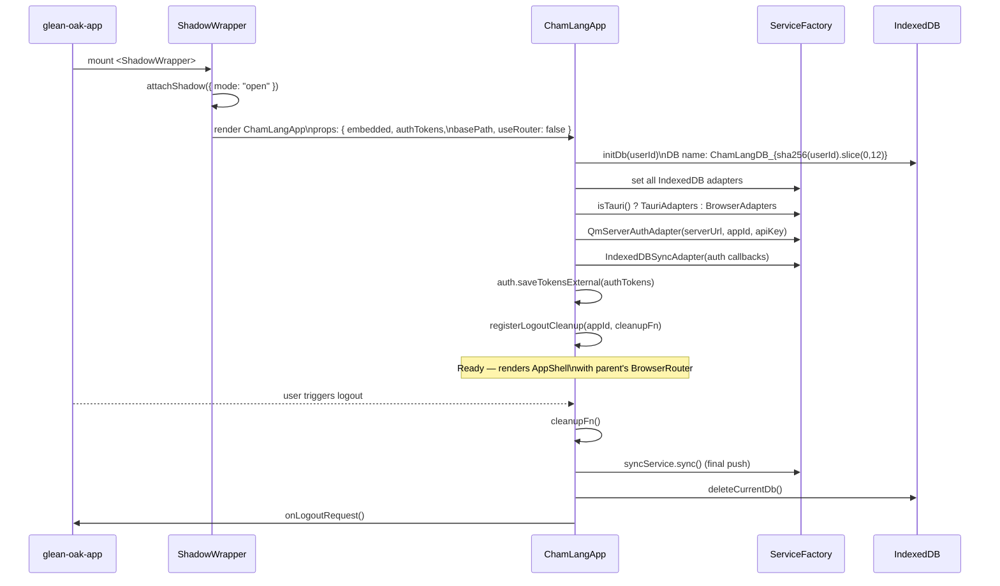
```mermaid
sequenceDiagram
    participant HUB as glean-oak-app
    participant SHADOW as ShadowWrapper
    participant APP as ChamLangApp
    participant FACTORY as ServiceFactory
    participant DB as IndexedDB

    HUB->>SHADOW: mount <ShadowWrapper>
    SHADOW->>SHADOW: attachShadow({ mode: "open" })
    SHADOW->>APP: render ChamLangApp\nprops: { embedded, authTokens,\nbasePath, useRouter: false }

    APP->>DB: initDb(userId)\nDB name: ChamLangDB_{sha256(userId).slice(0,12)}
    APP->>FACTORY: set all IndexedDB adapters
    APP->>FACTORY: isTauri() ? TauriAdapters : BrowserAdapters
    APP->>FACTORY: QmServerAuthAdapter(serverUrl, appId, apiKey)
    APP->>FACTORY: IndexedDBSyncAdapter(auth callbacks)

    APP->>APP: auth.saveTokensExternal(authTokens)
    APP->>APP: registerLogoutCleanup(appId, cleanupFn)

    Note over APP: Ready — renders AppShell\nwith parent's BrowserRouter

    HUB-->>APP: user triggers logout
    APP->>APP: cleanupFn()
    APP->>FACTORY: syncService.sync() (final push)
    APP->>DB: deleteCurrentDb()
    APP->>HUB: onLogoutRequest()
```

### Props Interface

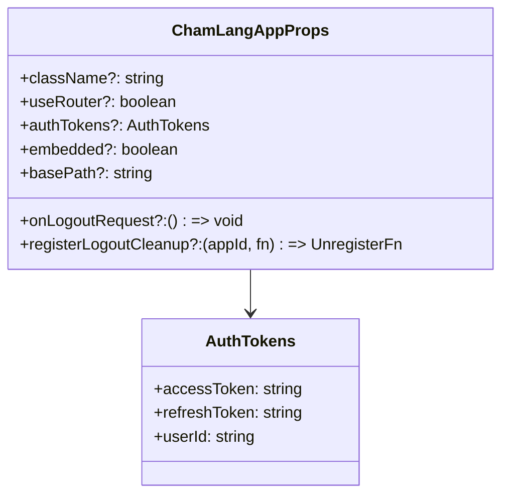
```mermaid
classDiagram
    class ChamLangAppProps {
        +className?: string
        +useRouter?: boolean
        +authTokens?: AuthTokens
        +embedded?: boolean
        +onLogoutRequest?: () => void
        +basePath?: string
        +registerLogoutCleanup?: (appId, fn) => UnregisterFn
    }

    class AuthTokens {
        +accessToken: string
        +refreshToken: string
        +userId: string
    }

    ChamLangAppProps --> AuthTokens
```

### Context Provider Stack

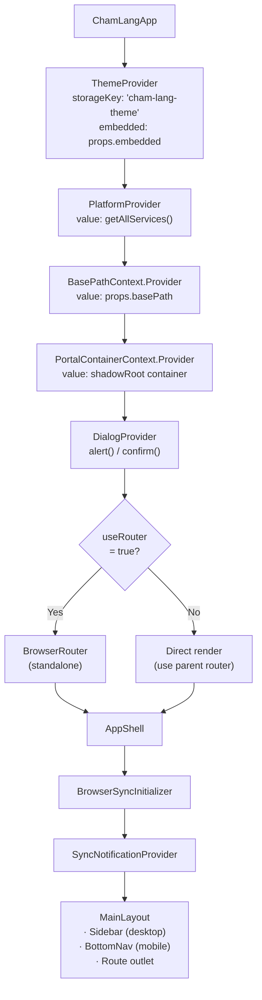
```mermaid
flowchart TD
    CLA["ChamLangApp"] --> TP["ThemeProvider\nstorageKey: 'cham-lang-theme'\nembedded: props.embedded"]
    TP --> PP["PlatformProvider\nvalue: getAllServices()"]
    PP --> BP["BasePathContext.Provider\nvalue: props.basePath"]
    BP --> PC["PortalContainerContext.Provider\nvalue: shadowRoot container"]
    PC --> DP["DialogProvider\nalert() / confirm()"]
    DP --> BR{"useRouter\n= true?"}
    BR -->|Yes| ROUTER["BrowserRouter\n(standalone)"]
    BR -->|No| DIRECT["Direct render\n(use parent router)"]
    ROUTER --> SHELL["AppShell"]
    DIRECT --> SHELL
    SHELL --> SYNC["BrowserSyncInitializer"]
    SYNC --> SNCP["SyncNotificationProvider"]
    SNCP --> LAYOUT["MainLayout\n· Sidebar (desktop)\n· BottomNav (mobile)\n· Route outlet"]
```

---

## 15. Spaced Repetition Algorithms

### Leitner Box System

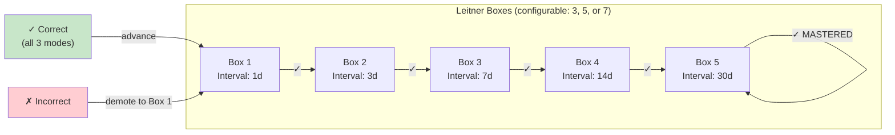
```mermaid
flowchart LR
    subgraph boxes["Leitner Boxes (configurable: 3, 5, or 7)"]
        B1["Box 1\nInterval: 1d"]
        B2["Box 2\nInterval: 3d"]
        B3["Box 3\nInterval: 7d"]
        B4["Box 4\nInterval: 14d"]
        B5["Box 5\nInterval: 30d"]
    end

    CORRECT["✓ Correct\n(all 3 modes)"] -->|"advance"| B1
    B1 -->|"✓"| B2
    B2 -->|"✓"| B3
    B3 -->|"✓"| B4
    B4 -->|"✓"| B5
    B5 -->|"✓ MASTERED"| B5

    INCORRECT["✗ Incorrect"] -->|"demote to Box 1"| B1

    style CORRECT fill:#c8e6c9
    style INCORRECT fill:#ffcdd2
```

### Box Interval Presets

| Boxes | Intervals (days) |
|-------|-----------------|
| 3 | 1, 7, 30 |
| 5 | 1, 3, 7, 14, 30 |
| 7 | 1, 2, 4, 7, 14, 30, 60 |

### Multi-Mode Cycle Requirement

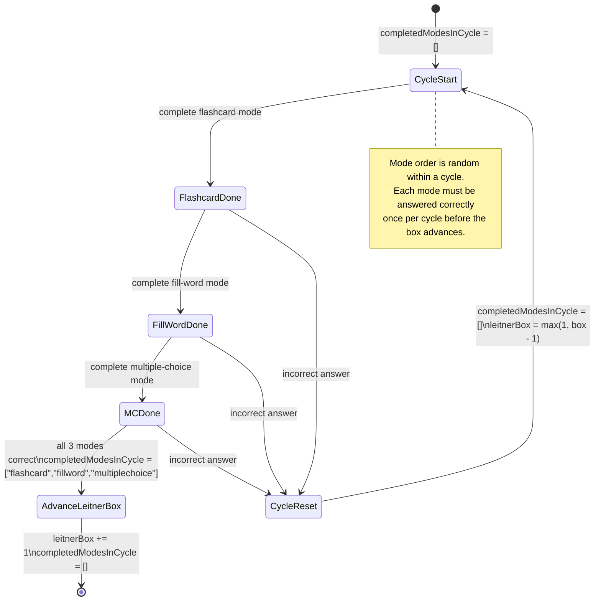
```mermaid
stateDiagram-v2
    [*] --> CycleStart : completedModesInCycle = []

    CycleStart --> FlashcardDone : complete flashcard mode
    FlashcardDone --> FillWordDone : complete fill-word mode
    FillWordDone --> MCDone : complete multiple-choice mode

    MCDone --> AdvanceLeitnerBox : all 3 modes correct\ncompletedModesInCycle = ["flashcard","fillword","multiplechoice"]
    AdvanceLeitnerBox --> [*] : leitnerBox += 1\ncompletedModesInCycle = []

    FlashcardDone --> CycleReset : incorrect answer
    FillWordDone --> CycleReset : incorrect answer
    MCDone --> CycleReset : incorrect answer
    CycleReset --> CycleStart : completedModesInCycle = []\nleitnerBox = max(1, box - 1)

    note right of CycleStart
        Mode order is random within a cycle.
        Each mode must be answered correctly
        once per cycle before the box advances.
    end note
```

### Algorithm Comparison

```mermaid
flowchart TD
    subgraph SM2["SM-2 (Classic)"]
        SM2_CALC["I(n) = I(n-1) × EF\nEF += 0.1 - (5-q)(0.08 + (5-q)×0.02)\nEF clamped to [1.3, 2.5]"]
    end

    subgraph MOD["Modified SM-2"]
        MOD_CALC["intervalDays = BOX_INTERVAL_PRESETS[boxCount][currentBox]\neasinessFactor = fixed (not adjusted)"]
    end

    subgraph SIMPLE["Simple Doubling"]
        SIMPLE_CALC["Correct: intervalDays × 2\nIncorrect: intervalDays = 1"]
    end

    CONFIG["LearningSettings.srAlgorithm"]
    CONFIG -->|"sm2"| SM2
    CONFIG -->|"modifiedsm2"| MOD
    CONFIG -->|"simple"| SIMPLE
```

### Word Status Classification (Session)

| Status | Condition | Reps Per Session |
|--------|-----------|-----------------|
| NEW | 0 total reviews | 3 |
| STILL_LEARNING | Box 2–3 or 3+ reviews | 2 |
| ALMOST_DONE | Box 4–5 or box 3 w/ some streak | 1 |
| MASTERED | Box 5+ or box 3 w/ ≥2 consecutive | 1 |

Max failures per word per session: **5** (then force-completed, demoted to box 1).

---

## 16. Component Hierarchy

### Atomic Design Layers

```mermaid
flowchart BT
    subgraph Atoms["atoms/"]
        A1["Button"]
        A2["Input"]
        A3["Select"]
        A4["TextArea"]
        A5["Modal / Dialog"]
        A6["Badge"]
        A7["Card"]
        A8["FlashCard"]
        A9["AudioPlayer"]
        A10["LoadingSpinner"]
        A11["Accordion"]
        A12["ErrorBoundary"]
    end

    subgraph Molecules["molecules/"]
        M1["VocabularyCard"]
        M2["CollectionCard"]
        M3["SearchBar"]
        M4["TopBar"]
        M5["HeroCard"]
        M6["FillWordCard"]
        M7["MultipleChoiceCard"]
        M8["StatsCard"]
        M9["SharedUserItem"]
        M10["BulkActionToolbar"]
    end

    subgraph Organisms["organisms/"]
        O1["VocabularyList"]
        O2["CollectionList"]
        O3["VocabularyForm"]
        O4["CollectionForm"]
        O5["AuthForm"]
        O6["Sidebar"]
        O7["BottomNavigation"]
        O8["SyncSettings"]
        O9["ShareCollectionDialog"]
        O10["BrowserSyncInitializer"]
    end

    subgraph Templates["templates/"]
        T1["AppShell\n(routing + layout)"]
        T2["MainLayout"]
    end

    subgraph Pages["pages/"]
        P1["HomePage"]
        P2["AddVocabularyPage"]
        P3["FlashcardPracticePage"]
        P4["CollectionsPage"]
        P5["SettingsPage"]
        P6["ProgressPage"]
        P7["... (20+ pages)"]
    end

    Atoms --> Molecules
    Molecules --> Organisms
    Organisms --> Pages
    Pages --> Templates
```

### Key Page → Component Relationships

```mermaid
flowchart TD
    subgraph HomePage
        HP_HERO["HeroCard\n(stats summary)"]
        HP_SEARCH["SearchBar"]
        HP_COLL["CollectionList"]
    end

    subgraph CollectionDetailPage
        CDP_HEADER["TopBar\n(collection name + actions)"]
        CDP_VOCAB["VocabularyList\n(filtered by collectionId)"]
        CDP_SHARE["ShareCollectionDialog"]
    end

    subgraph PracticePage["FlashcardPracticePage"]
        PP_SM["SessionManager\n(class instance)"]
        PP_CARD["FlashCard atom"]
        PP_STATS["StatsCard\n(session summary)"]
    end

    subgraph SettingsPage
        SP_THEME["Theme selector"]
        SP_LANG["Language selector (i18n)"]
        SP_SYNC["SyncSettings organism"]
        SP_GDRIVE["GDrive backup controls"]
    end
```

---

## 17. Internationalization (i18n)

```mermaid
flowchart LR
    subgraph Config["i18n/index.ts"]
        I18N["i18next.init()\nlanguages: ['en', 'vi']\nfallback: 'en'\nstorage: localStorage('app_language')"]
    end

    subgraph Resources["i18n/locales/"]
        EN["en/translation.json"]
        VI["vi/translation.json"]
    end

    subgraph Usage["Components"]
        HOOK["useTranslation()\n→ t('key')"]
        CHANGE["i18n.changeLanguage('vi')\n→ localStorage update"]
    end

    Config --> Resources
    Resources --> Usage
```

| Aspect | Value |
|--------|-------|
| Library | `i18next` + `react-i18next` |
| Languages | English (`en`), Vietnamese (`vi`) |
| Storage key | `app_language` in localStorage |
| Fallback | English |
| Namespace | Single `translation` namespace |

---

## 18. Key Invariants & Anti-Patterns

### Invariants — never violate these

| # | Invariant |
|---|-----------|
| 1 | **All data goes through ServiceFactory getters** — never import an adapter directly in a component or hook |
| 2 | **All write paths set `syncVersion=Date.now()` and `syncedAt=null`** — omitting either breaks sync detection |
| 3 | **Client generates UUIDs** — never rely on server to assign `id` |
| 4 | **`practiceSessions` is local-only** — never add it to the sync push/pull tables list |
| 5 | **`collectionSharedUsers` is viewer-only** — sharing permissions are enforced server-side only; ignore any client-side `permissions` field logic |
| 6 | **Never bypass `SessionManager`** in practice pages — it owns SM-2 state and word queue |
| 7 | **Soft-delete only** — never hard-delete synced records; set `deleted=1` + `deletedAt=Date.now()` |
| 8 | **Web Lock `"cham-lang-sync"`** must wrap every sync cycle — prevents multi-tab data races |
| 9 | **Theme changes in embedded mode** use `CustomEvent("cham-lang-theme-change")` on `window` — never mutate `document.documentElement` directly when `embedded=true` |
| 10 | **CSS: no hardcoded hex** for theme-sensitive colors — use `var(--color-*)` properties |

### Anti-Patterns

```tsx
// ❌ Direct adapter import in component
import { IndexedDBVocabularyAdapter } from '@/adapters/web/vocabulary'

// ✅ Via factory
import { getVocabularyService } from '@/adapters/factory'
const svc = getVocabularyService() // throws if not init'd

// ❌ Hard-delete
await db.vocabularies.delete(id)

// ✅ Soft-delete
await db.vocabularies.update(id, { deleted: 1, deletedAt: Date.now(), syncVersion: Date.now(), syncedAt: null })

// ❌ Theme manipulation in embedded mode
document.documentElement.className = 'dark'

// ✅ In embedded mode
window.dispatchEvent(new CustomEvent('cham-lang-theme-change', { detail: { theme: 'dark' } }))

// ❌ Hardcoded color
<div className="bg-indigo-600 text-white">

// ✅ Theme-aware
<div className="btn-primary text-white">    {/* uses .btn-primary CSS util */}
<span className="text-(--color-primary-500)">

// ❌ Gradient (breaks in Shadow DOM)
<button className="bg-gradient-to-r from-indigo-500 to-purple-600">

// ✅ Solid via CSS util
<button className="btn-primary">
```
